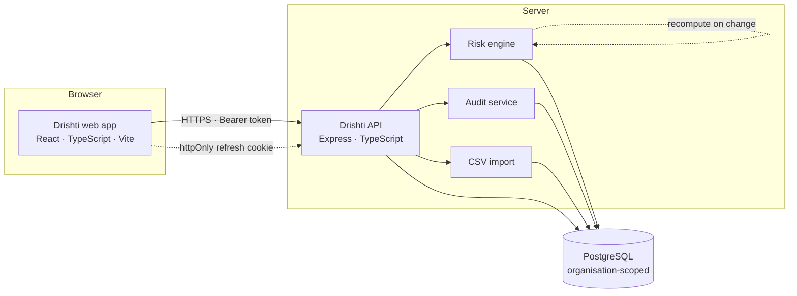

# Drishti — Architecture Overview

Accurate to the implementation at frontend `a34ff7d` / backend `ac99f3e`.
Where a design decision has a reason, the reason is given — those are usually
the parts a technical evaluator asks about.

---

## Shape



Two deployable units — a static web bundle and an API — over one database.
Both ship as containers.

---

## Frontend

A single-page application: **React 18**, **TypeScript 5**, built with
**Vite 5**, styled with **Tailwind 3** over a token layer that carries the
light and dark themes.

Server state is held by **TanStack Query 5**; routing by **React Router 6**.

Two properties are worth naming because they are load-bearing:

- **The UI never re-derives a risk band.** Scores and bands come from the API
  and are rendered as received. A client that recomputed would eventually
  disagree with the platform, and the disagreement would surface in front of
  an auditor.
- **Lists are server-paginated.** Every list request returns a page plus a
  meta block describing the whole set, so a count on screen always describes
  the dataset rather than the page.

Delivered by nginx in the container image, which serves the SPA fallback and
sets the security headers on every response class — the shell, the
fingerprinted bundles and the fallback routes alike.

## Backend

**Express 5** on **Node 20+**, written in TypeScript, with **Zod** validating
every request body, query and parameter at the edge.

87 endpoints. Every one is scoped to an organisation, and every write is
audited.

Structure is conventional and deliberately boring: `routes/` for HTTP and
authorisation, `services/` for behaviour, `lib/` for shared plumbing. The risk
engine and the audit service are services with a single entry point each, so
there is one place where a score is computed and one place where an audit row
is written.

Hardened with **Helmet** and per-route **rate limiting** — a generous global
budget, and a stricter one on login that counts only failures, so a user
signing in legitimately is never locked out while someone guessing burns their
budget quickly.

## Database

**PostgreSQL 14**, accessed through **Prisma 7**. Schema changes are
migrations; six are applied.

Every application table carries an `organizationId`. That column is the
isolation boundary, and it is enforced in the service layer on every query
rather than left to the caller.

Integration tests run against a real PostgreSQL rather than a mock, and the
test harness refuses to start against any database whose name does not contain
`test` — the suite truncates every table, so refusing is the correct response
to a misconfiguration rather than a warning.

## Authentication

Two credentials, deliberately handled differently:

| | Lifetime | Where it lives | Why |
|---|---|---|---|
| **Access token** (JWT) | 1 hour | In memory in the browser tab | Never persisted, so nothing readable by a script grants access |
| **Refresh token** (opaque) | 30 days | `httpOnly` cookie | JavaScript cannot read it, so an XSS payload that can read everything readable still cannot mint a session |

That split is what lets a page reload restore a session without storing a
credential anywhere a script can reach: on boot the app exchanges the cookie
for a new access token.

Refresh tokens **rotate on every use**, and presenting an already-rotated
token revokes every session for the account — it is treated as theft. Because
of that, refresh is single-flighted: several requests meeting an expired token
at the same moment produce one refresh, not several.

A refresh ends the session only when the server says **401** or **403**. A
rate limit, a server error, a timeout or a dropped connection leave the
session intact and are retried on a bounded backoff that honours
`Retry-After` — an unanswered question is not an answer of "no".

Cookies are `httpOnly` always, and `secure` with `SameSite=None` derived from
the environment, so a production deployment is secure by default rather than
by remembering to set a flag.

## Authorization

Three roles, enforced by the platform rather than by the interface:

| Role | Reads | Assesses | Configures |
|---|---|---|---|
| **Viewer** | yes | no | no |
| **Analyst** | yes | yes | no |
| **Admin** | yes | yes | yes |

The interface hides what a role cannot reach, but that is a courtesy — the API
refuses regardless, and a typed URL gets the same answer as a hidden button.

Controls are the interesting case, because the line runs *through* the record
rather than around it. Recording how well a control is working — its status,
its assessed effectiveness, when it was last reviewed — is assessment, and an
analyst may do it. Renaming it, recategorising it or changing its owner is
configuration, and an administrator must. The platform decides by reading the
request body, and its refusal names the offending fields so an interface can
grey exactly those out.

**Audit** and **import** are administrator-only. The audit trail names who did
what from which address; the import contract describes the shape of the
estate.

## Tenant isolation

Every record carries an organisation. Every query is scoped to the
organisation in the **signed session token** — never to an organisation named
by the caller.

A request for another organisation's record returns **404 Not Found**, not
403 Forbidden. A 403 would confirm that the record exists, which is itself a
disclosure. Creating a record always places it in the caller's own
organisation; an `organizationId` supplied in a request body is ignored.

## Risk engine

One engine scores both assets and vendors, and both share one history table,
so the numbers are directly comparable.

```
score = likelihood × impact × exposure × control gap
```

Likelihood and impact are the customer's assessment. **Exposure** and
**control gap** are *derived* from facts already recorded — encryption, MFA,
PHI volume, vendor agreement status, which controls are applied — rather than
estimated, so they cannot drift from the estate they describe.

Two properties matter in a compliance setting:

- **It recomputes on its own.** Changing something that feeds a score — a PHI
  volume, an encryption flag, a vendor's BAA status — triggers a recompute in
  the same request, and both the change and the recompute are audited.
- **It is idempotent.** Recomputing when nothing has changed produces no new
  history row and reports that nothing changed. The history is a record of
  real movement, not of how often somebody pressed a button.

## Audit

Every write records an event: the action, the actor, the subject, the result
and the source address.

It is **read-only**. There is no write path in the API or the interface for
any role, including administrators — the only writer is the platform's own
audit service. A trail you can add entries to is not a trail.

Metadata is sanitised before storage against a forbidden-key list covering
both credentials (`password`, `token`, `secret`, `authorization`, `cookie`,
`apikey`) and patient identifiers (`ssn`, `dob`, `mrn`, `patient`),
recursively and depth-limited, with long strings truncated. Audit metadata
describes *what changed*; the patient identifier that changed is PHI and has
no business in a log.

## Demo environment

The demo organisation is a **separate tenant** in the same database —
*Drishti Demo Healthcare*, with its own admin, analyst and viewer accounts on
a non-routable `.invalid` domain. It is isolated from every other
organisation by the same boundary that separates customers.

Two commands manage it:

- `npm run db:seed:demo` — **additive**. Seeds the demo organisation without
  deleting anything, so a rehearsal that added records keeps them.
- `npm run db:demo:reset` — **scoped delete and re-seed**, for returning to a
  known state before a customer demonstration.

The reset genuinely deletes, so its scoping is enforced rather than intended:
every statement carries the organisation, there is no `TRUNCATE`, no `DROP`
and no unscoped delete, and rows outside the demo organisation are counted
immediately before and after the deletions **inside the same transaction**. If
one count moves, the whole transaction rolls back and nothing is deleted at
all — a scoping mistake fails loudly and changes nothing rather than
half-destroying a tenant. It also refuses to run under `NODE_ENV=production`
without an explicit override.

See `DRISHTI_DEMO_OPERATIONS.md`.

## Deployment

Both units ship as container images. The API needs a PostgreSQL connection
string, a signing secret and the permitted browser origin; the web image needs
nothing at runtime beyond the API's address baked in at build time.

Continuous integration runs typecheck, lint and the full integration suite
against a real PostgreSQL on every push, with migrations applied as part of
the run.
