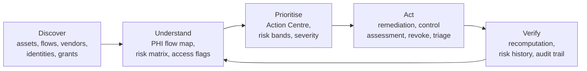
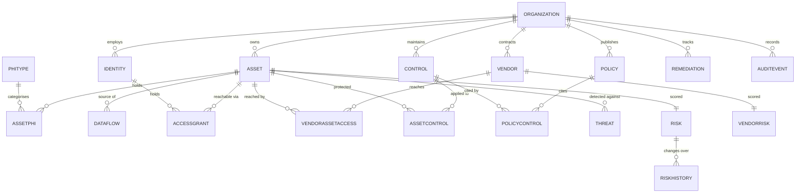
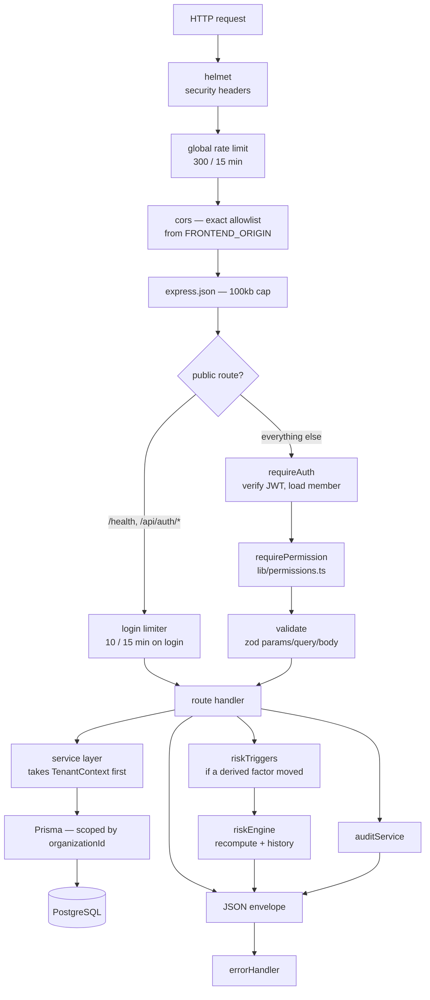
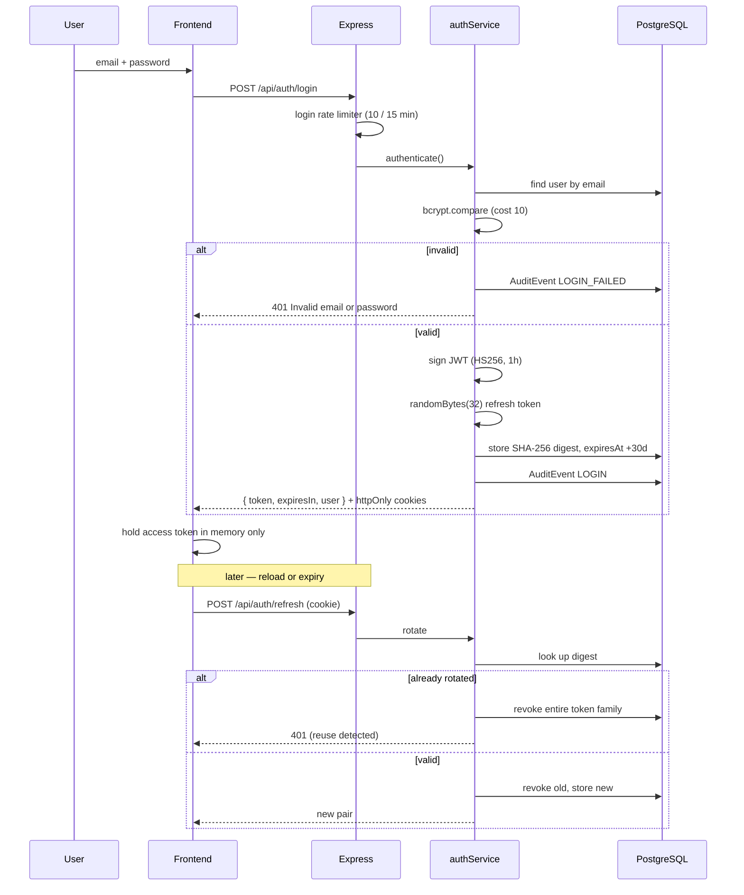
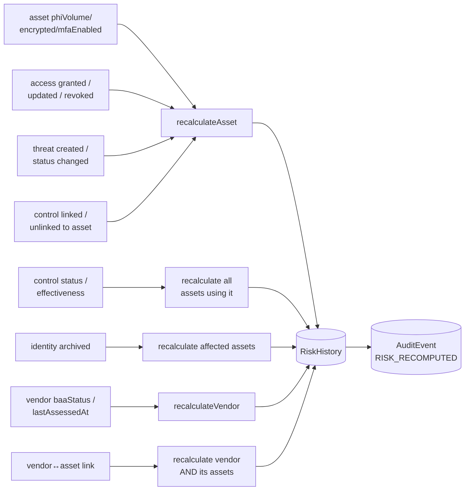
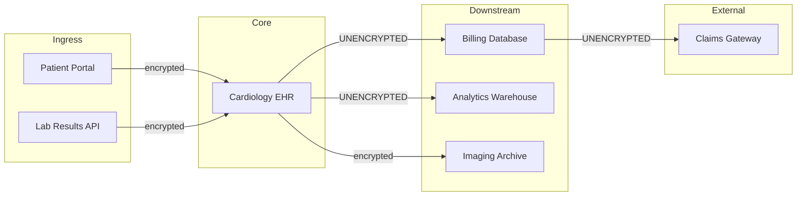
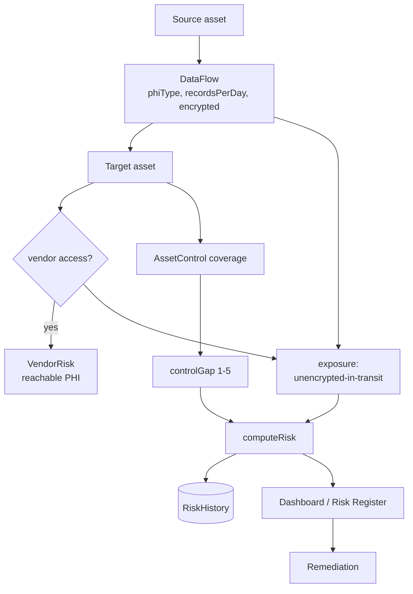
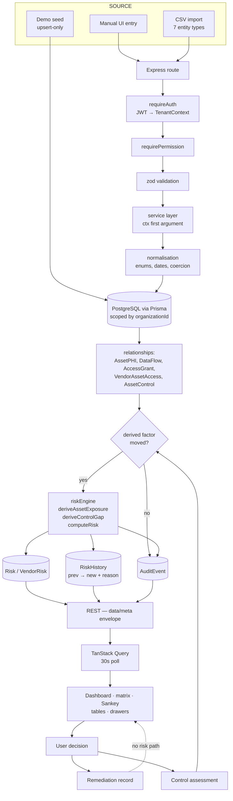
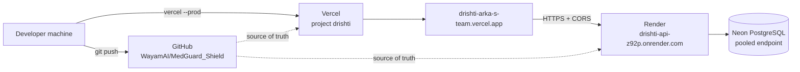
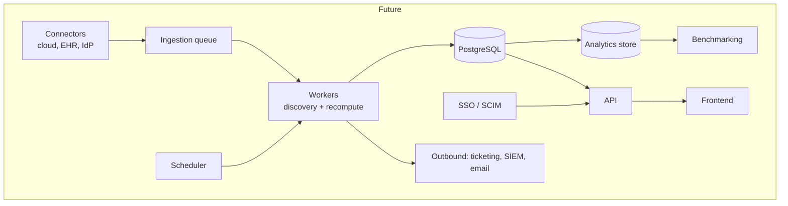

# DRISHTI — Complete System, Product and Business Documentation

**Status of this document:** reverse-engineered from the source at
frontend `feat/ui-overhaul` @ `df906b8` and the sibling backend repository
`medguard-backend` @ `0.3.0`. Every technical claim below was read out of the
code. Where something could not be established from the repository it says so
explicitly.

**Reading the status labels.** Each feature carries one of:
`IMPLEMENTED` · `PARTIAL` · `UI-ONLY` · `BACKEND-ONLY` · `PLANNED` · `NOT IMPLEMENTED` · `UNKNOWN`.
Business sections are separately labelled **FACT**, **MARKET RESEARCH**,
**ANALYSIS** or **HYPOTHESIS**. Nothing in the roadmap or business half should
be read as describing shipped functionality.

---

## Table of contents

1. [Executive summary](#1-executive-summary)
2. [The product concept](#2-the-product-concept-discover--understand--prioritise--act--verify)
3. [System inventory](#3-system-inventory)
4. [Conceptual model](#4-conceptual-model)
5. [Database](#5-database)
6. [Backend architecture](#6-backend-architecture)
7. [Frontend architecture](#7-frontend-architecture)
8. [Authentication](#8-authentication)
9. [Authorisation / RBAC](#9-authorisation--rbac)
10. [Tenancy and isolation](#10-tenancy-and-isolation)
11. [The risk engine](#11-the-risk-engine)
12. [PHI data flow](#12-phi-data-flow)
13. [Feature reference](#13-feature-reference)
14. [End-to-end workflows](#14-end-to-end-workflows)
15. [Master data pipeline](#15-master-drishti-data-pipeline)
16. [Audit logging](#16-audit-logging)
17. [Security](#17-security)
18. [Testing](#18-testing)
19. [Deployment](#19-deployment)
20. [Demo environment](#20-demo-environment)
21. [Master feature matrix](#21-master-feature-matrix)
22. [Master API inventory](#22-master-api-inventory)
23. [Master database map](#23-master-database-map)
24. [Master role matrix](#24-master-role-matrix)
25. [Business: problem and market](#25-business--the-problem)
26. [Customer segments](#26-customer-segments)
27. [Buyer personas](#27-buyer-personas)
28. [Competitive landscape](#28-competitive-landscape-market-research)
29. [Differentiation](#29-differentiation)
30. [Go-to-market](#30-go-to-market)
31. [Sales approach](#31-sales-approach)
32. [Pricing](#32-pricing-strategic-hypothesis)
33. [Roadmap](#33-roadmap)
34. [Limitations and risks](#34-limitations-and-risks)
35. [Future architecture](#35-future-architecture)
36. [Master end-to-end scenario](#36-master-end-to-end-scenario)
37. [Glossary](#37-glossary)
38. [Source traceability](#38-source-traceability)

---

## 1. Executive summary

### What DRISHTI is

DRISHTI is a web application that answers one question for a healthcare
organisation: **where is our protected health information, and what is the
risk to it right now?**

It is not a document repository and not a questionnaire tool. It maintains a
connected model of the estate — the systems that hold PHI, the flows that move
it between them, the people and service accounts that can reach it, the third
parties who touch it, and the safeguards that are supposed to protect it — and
derives a risk score per system and per vendor from that model. When any
underlying fact changes, the affected scores are recomputed and the reason is
written to history.

### Who uses it

Three roles exist in the code (`src/lib/permissions.ts`):

- **ADMIN** — configures the estate. Creates and retires assets, vendors,
  identities, controls and policies; grants and revokes access; reads the audit
  trail; runs CSV imports.
- **ANALYST** — works *within* the estate someone else configured. Assesses
  risk, investigates threats, drives remediation, attests to access reviews,
  records control effectiveness. Cannot change what the estate *is*.
- **VIEWER** — reads everything except the audit trail and the import contract.

### The problem it solves

A healthcare organisation is accountable for PHI it often cannot fully locate.
The information needed to judge exposure is real but scattered: the asset
inventory in a spreadsheet, the BAA register in a shared drive, access reviews
in a ticketing system, the risk assessment in a consultant's PDF from last
year. Each artefact is individually defensible and collectively unable to
answer "if this vendor were breached tomorrow, how many records are behind
them, and what is protecting those records?"

DRISHTI's answer is to hold those facts in one relational model and compute the
consequences continuously rather than annually.

### What information it brings together

| Input | Where it lives | Feeds |
|---|---|---|
| Systems holding PHI, volume, encryption, MFA | `Asset` | Exposure, dashboard, risk |
| PHI categories and sensitivity | `PHIType`, `AssetPHI` | Flow map, reporting |
| Movement of PHI between systems | `DataFlow` | Flow map, exposure, violations |
| People and service accounts | `Identity` | Access review |
| Who can reach what, at what level | `AccessGrant` | Exposure, access flags |
| Third parties and their BAA status | `Vendor`, `VendorAssetAccess` | Vendor risk, exposure |
| Safeguards and their assessed effectiveness | `Control`, `AssetControl` | Control gap |
| Written policy and the controls it cites | `Policy`, `PolicyControl` | Governance view |
| Detections against a system | `Threat` | Exposure |
| Findings with an owner and a date | `Remediation` | Action tracking |
| Every write, who made it | `AuditEvent` | Audit trail |

### What decisions it supports, and what a user can do

The dashboard ranks unresolved findings across every source, worst first. From
there a user can open the record behind a finding, reassess a risk, change a
control's assessed effectiveness, revoke or attest to an access grant, move a
threat through triage, assign remediation, and record a vendor assessment.
Every one of those writes is audited, and the ones that move a derived factor
trigger recomputation.

### The outcome

A defensible, continuously-updated risk position with an evidence trail — not
a compliance score. The codebase is deliberate about this: `reportService.ts`
states that a single percentage claiming HIPAA posture "would be a fabricated
metric, and this product does not get to assert one." What it reports instead
is coverage and outstanding work.

> **Note on compliance.** DRISHTI implements security *capabilities*. It holds
> no certification, and nothing in the repository substantiates a claim of
> HIPAA compliance, SOC 2 attestation or equivalent. A prior "HIPAA Compliant"
> badge was removed from the UI for exactly this reason (commit `6c85871`).

---

## 2. The product concept: Discover → Understand → Prioritise → Act → Verify

Each stage below names only implemented functionality.



**Discover** — `IMPLEMENTED, with a caveat.` The estate is populated by manual
entry through the UI, or by CSV import across seven entity types
(`src/services/importSpec.ts`). There is **no automated discovery**: DRISHTI
does not scan a cloud account, query an EHR, or read a directory. Everything it
knows, somebody told it.

**Understand** — `IMPLEMENTED.` The PHI Flow map renders the estate as a
four-stage Sankey (ingress → core → downstream → external recipients) sized by
daily record volume and coloured by encryption status. The risk matrix plots
every scored asset by likelihood × impact. The access review lists every grant
ordered by how much is wrong with it.

**Prioritise** — `IMPLEMENTED.` The dashboard's Action Centre lists real
findings across five sources, ordered by severity rather than by which
endpoint answered first.

**Act** — `IMPLEMENTED.` Remediation records carry an owner, a due date, a
severity and a status machine. Controls carry an assessed effectiveness.
Grants can be revoked or attested. Threats move through a transition set the
server publishes.

**Verify** — `IMPLEMENTED.` Recomputation is automatic on the mutations that
move a derived factor; each movement writes a `RiskHistory` row carrying the
previous score, the new score and a machine-readable reason, plus an audit
event carrying the human-readable derivation.

---

## 3. System inventory

### Frontend — `medguard-shield-main`

| Concern | Choice | Notes |
|---|---|---|
| Framework | React 18.3 | SPA, no SSR |
| Language | TypeScript 5.8 | `strictNullChecks` **off** — see Limitations |
| Build | Vite 5.4 | output to `dist/`, assets under `/static/` |
| Styling | Tailwind 3.4 + CSS custom properties | semantic tokens in `src/styles/tokens.css` |
| Routing | react-router-dom 6.30 | `src/App.tsx` |
| Server state | TanStack Query 5.83 | wrapped by `src/hooks/useApiQuery.ts` |
| Charts | Recharts 2.15 + bespoke SVG | the Sankey and matrix are hand-written |
| Forms | react-hook-form 7.61 + zod 3.25 | |
| Icon system | Two-tier: Lucide/custom line art + 3D raster | see §13 |
| Theme | Light/dark via `data-theme` + `localStorage` | `src/hooks/use-theme.tsx` |
| Tests | Vitest 3.2 + Testing Library | 299 passing, 24 files |

### Backend — `medguard-backend`

| Concern | Choice | Notes |
|---|---|---|
| Runtime | Node.js, ESM | `tsx` in dev, compiled `dist/` in prod |
| Framework | Express 5.2 | |
| ORM | Prisma 7.10 | client generated to `src/generated/prisma` |
| Database | PostgreSQL | Neon in production |
| Auth | `jsonwebtoken` 9 + `bcryptjs` 3 | HS256 access token, opaque rotating refresh |
| Validation | zod 4.6 | `src/middleware/validate.ts` |
| Security | `helmet` 8, `cors` 2.8, `express-rate-limit` 8.7 | |
| Upload | `multer` 2.4 | CSV import only |
| Tests | Vitest 3.2 | 98 unit tests passing, 4 files |

### Notable absences (verified)

- **No background worker, queue or scheduler.** All computation is synchronous
  inside the request that triggered it.
- **No cache layer.** No Redis, no in-process memoisation of query results.
- **No outbound integrations.** No email, Slack, SIEM, ticketing or cloud SDK
  is present in either `package.json`.
- **No file storage.** Uploaded CSVs are parsed in memory and discarded.
- **No WebSocket/SSE.** The "Live" indicator in the UI is TanStack Query
  polling on a 30s interval, not a push channel.

---

## 4. Conceptual model

The asset is the hub. Everything else is a fact attached to an asset, and risk
is the consequence of those facts.



### What each relationship means, and what it moves

| Relationship | Meaning | API | Frontend | Risk effect |
|---|---|---|---|---|
| Asset → AssetPHI → PHIType | which categories of PHI this system holds, and how sensitive | `/api/assets/:id` | Assets drawer, PHI tab | none directly; `phiVolume` on the asset drives exposure |
| Asset → DataFlow → Asset | PHI moving between two systems, with volume and encryption | `/api/dataflows` | PHI Flow map | unencrypted outbound flows add exposure |
| Identity → AccessGrant → Asset | who can reach what, at READ/WRITE/ADMIN | `/api/access` | Access review | grant count and elevation add exposure |
| Vendor → VendorAssetAccess → Asset | which third parties can reach which systems | `/api/vendors/:id/assets/:assetId` | Vendors drawer | vendor count adds asset exposure; reachable PHI drives vendor exposure |
| Control → AssetControl → Asset | which safeguards apply here, and how well they work | `/api/controls/:id/assets/:assetId` | Controls | effective + partial coverage sets control gap |
| Policy → PolicyControl → Control | written policy citing the controls that implement it | `/api/policies/:id/controls/:controlId` | Policies | **none** — policy does not feed risk |
| Threat → Asset | a detection against a system | `/api/threats` | Threats | an open HIGH/CRITICAL threat adds exposure |
| Remediation → subject | a finding with an owner and a date | `/api/remediations` | Remediation | **none** — closing a finding does not by itself move a score |

Two of those are worth stating plainly because they are the kind of thing a
demo can imply and the code does not do: **policy status does not affect risk**,
and **resolving a remediation does not affect risk**. Risk moves only when the
underlying fact moves.

---

## 5. Database

22 models, 20 enums, 6 migrations. Every customer-data model carries
`organizationId`.

### Core estate

**`Organization`** — the tenant. Owns every other scoped row; deletion
cascades. Business meaning: one customer, or one demo environment.

**`OrganizationMember`** — the join between a `User` and an `Organization`,
carrying the `Role`. This is where a user's role actually lives; the `role`
column on `User` is a default. Business meaning: a person can in principle
belong to more than one organisation with different roles.

**`User`** — a login. `passwordHash` is nullable (an account may exist for
external auth), `externalAuthId` is unique and reserved. Business meaning: a
Drishti account, distinct from an `Identity`.

**`RefreshToken`** — one row per issued refresh token, stored as a SHA-256
digest with an `expiresAt` and a revocation marker. Business meaning: the
session ledger; this is what logout and reuse-detection operate on.

**`Asset`** — a system, service or data store that holds or moves PHI. Fields
that matter to risk: `phiVolume`, `encrypted`, `mfaEnabled`. Also `type`
(EHR / DATABASE / API / CLOUD_STORAGE / ANALYTICS / OTHER), `lastAssessedAt`,
`archivedAt`. Business meaning: the unit an organisation actually owns and can
act on.

**`PHIType` / `AssetPHI`** — a category of PHI (with a `Sensitivity`) and the
join recording that an asset holds it, with a per-asset record count. Business
meaning: not all PHI is equal; genomic and clinical notes are not demographics.

**`DataFlow`** — directed movement of one PHI type from a source asset to a
target asset, with `recordsPerDay` and `encrypted`. Business meaning: the edge
that turns an inventory into a map.

### Risk

**`Risk`** — exactly one per asset (`@@unique([assetId])`). Holds the four
factors, the normalised `score`, the `band`, and two pinning flags:
`exposureOverridden` and `controlGapOverridden`. Business meaning: the current
assessed position for one system, and whether a human has overruled the
derivation.

**`VendorRisk`** — the same for a vendor.

**`RiskHistory`** — an append-only change log. Carries `previousScore` /
`previousBand` alongside the new values, all four factors, a
`RiskChangeReason`, and who triggered it. `subjectType` discriminates asset
from vendor. Business meaning: the answer to "why did this go from 65 to 72",
and the evidence that the programme is working.

### Third party, identity, governance

**`Vendor`** — a third party, with `baaStatus` (SIGNED / PENDING / EXPIRED /
MISSING), `phiVolume` and `lastAssessedAt`.
**`VendorAssetAccess`** — which assets a vendor can reach.
**`Identity`** — a person or service account (`IdentityKind`), with `active`
and `mfaEnabled`.
**`AccessGrant`** — an identity's access to an asset at an `AccessLevel`, with
`grantedAt`, `lastUsedAt`, `lastReviewedAt`, `revokedAt`.
**`Control`** — a safeguard, with `category`, `status`, `effectiveness`,
`owner` and a free-text `frameworkRef`. The code is explicit that the framework
reference is a citation the customer typed and asserts no conformance.
**`AssetControl`** — which controls apply to which assets.
**`Policy` / `PolicyControl`** — written policy and the controls it cites.
**`Threat`** — a detection against an asset, with severity and status.
**`Remediation`** — a finding with `severity`, `status`, `source`, an optional
owner, a due date, and nullable pointers to every subject type it might
reference.
**`AuditEvent`** — see §16.

---

## 6. Backend architecture



**Layers, and what each owns.**

- **`src/app.ts`** — composition root. Middleware order is load-bearing:
  `requireAuth` is mounted on `/api` *after* the auth router, so
  `/api/auth/login` is reachable unauthenticated and everything else is not.
- **`src/middleware/auth.ts`** — extracts a bearer token (falling back to a
  cookie), verifies it, loads the `OrganizationMember` to build a
  `TenantContext`, and exposes `requirePermission`.
- **`src/middleware/validate.ts`** — zod schemas per route for `params`,
  `query` and `body`.
- **`src/routes/*`** — thin. Parse, authorise, call a service, trigger risk,
  record audit, respond.
- **`src/services/*`** — all business logic. Every service that touches
  customer data takes a `TenantContext` as its first argument.
- **`src/lib/*`** — `tenant.ts` (scoping), `permissions.ts` (the matrix),
  `pagination.ts`, `errors.ts`, `http.ts`, `prisma.ts`.

**Pure-function split.** `riskScoring.ts`, `riskFactors.ts`, `flowStatus.ts`
and `importParsing.ts` import no Prisma and are unit-tested directly. This is a
deliberate, repeated pattern.

**Response envelope.** Single resources return `{ data }`; collections return
`{ data, meta: { page, pageSize, total, totalPages } }` with `meta` as a
sibling of `data`, not nested.

---

## 7. Frontend architecture

### Route inventory

| URL | Component | Role required | Principal API calls |
|---|---|---|---|
| `/login` | `Login` | none | `POST /api/auth/login`, `/refresh` |
| `/` | `Dashboard` | any | assets, risks, dataflows, vendors, access/summary, threats/summary, controls, remediations/summary, audit |
| `/assets` | `Assets` | any | `/api/assets`, `/api/assets/:id` |
| `/phi-flow` | `PhiFlow` | any | `/api/dataflows` |
| `/risks` | `Risks` | any | `/api/risks`, `/api/risks/:assetId/recompute` |
| `/vendors` | `Vendors` | any | `/api/vendors`, `/api/vendors/:id` |
| `/access` | `Access` | any | `/api/access`, `/api/access/summary` |
| `/threats` | `Threats` | any | `/api/threats`, `/api/threats/summary` |
| `/controls` | `Controls` | any | `/api/controls`, `/api/controls/:id` |
| `/policies` | `Policies` | any | `/api/policies`, `/api/policies/:id` |
| `/remediation` | `Remediation` | any | `/api/remediations`, `/summary` |
| `/audit` | `Audit` | **ADMIN** | `/api/audit` |
| `/users` | `Users` | any | `/api/identities`, `/api/organization/members` |
| `/settings` | `Settings` | any | `/api/organization` |
| `/import` | `ImportData` | **ADMIN** | `/api/import/*` |
| `*` | `NotFound` | any | none |

Route-level role gating is in `src/App.tsx` via `ProtectedRoute requireRole`,
and mirrored in the sidebar so a non-admin is not offered a door the router
will bounce them from. **Both are cosmetic** — the server enforces
independently.

### Shared component layer

- **`ui-bits.tsx`** — primitives: `Btn`, `Badge`, `Card`, `Input`, `Select`,
  `Modal`, `SlideOver`, `SectionHeader`, `EmptyState`, `ErrorState`,
  `ChartSkeleton`, `Gauge`.
- **`ui-patterns.tsx`** — arrangements: `PageHeader`, `MetricCard`,
  `PostureCard`, `EntityAvatar`, `EntityMark`, `RiskBadge`, `RiskScore`,
  `RiskBandScale`, `MiniBar`, `FilterBar`, `Field`/`FieldGroup`, `Tabs`.
- **`DataTable.tsx`** — server-paginated table with sort, search and column
  visibility.
- **`DataState.tsx`** — the three non-happy paths in one place: loading
  skeleton, empty state, error state, plus a distinct expired-session state.
- **`RiskMatrix.tsx`**, **`PhiSankey.tsx`** — bespoke SVG.

### Data layer

`src/lib/apiClient.ts` owns the envelope, the bearer header, and a single
refresh-then-replay on 401. `src/hooks/useApiQuery.ts` wraps TanStack Query
with a 30s poll while healthy, a 5s reconnect poll while down, bounded retries,
and — since `3e6d1c9` — no retry or poll at all on a settled 4xx.

**Token handling is deliberate.** The access token lives in memory only and is
never written to `localStorage`. On reload the app calls `POST /api/auth/refresh`
and recovers the session from an httpOnly cookie that scripts cannot read.
`apiClient` sends `credentials: "omit"` on ordinary calls so the Authorization
header is the only thing that can grant access.

---

## 8. Authentication



**Mechanics, verified.**

- Password hashing: `bcrypt` cost 10 (`authService.hashPassword`).
- Access token: HS256 JWT, **3600s**. Carries the user claim; verified per
  request.
- Refresh token: 32 bytes of CSPRNG output, **30 days**, stored as a SHA-256
  digest. The code explains the choice: not bcrypt, because these are not
  guessable secrets and the refresh path would pay bcrypt's cost every call.
- **Rotation with reuse detection.** Presenting an already-rotated token
  revokes the whole family — the documented reasoning being that a thief's
  copy must not keep working.
- Logout revokes the presented token; `POST /api/auth/logout-all` revokes every
  token for the user.
- Failure behaviour: 401 for bad credentials and expired sessions, with a
  deliberately identical message for unknown-user and wrong-password.

**Legacy note.** `middleware/auth.ts` still *accepts* a `medguard_token`
cookie from before the rename, but never issues one. Marked for removal.

---

## 9. Authorisation / RBAC

Authorisation is a single matrix in `src/lib/permissions.ts` with ~45 named
permissions. `can(role, permission)` is the only decision point.

```
ADMIN    → true for everything
VIEWER   → true only for READ_PERMISSIONS
ANALYST  → READ_PERMISSIONS ∪ ANALYST_GRANTS
```

The design line, quoted from the source: *"does this change the inventory, or
does it change our assessment of the inventory?"*

**`ANALYST_GRANTS`** (verbatim): `asset:assess`, `vendor:assess`,
`threat:create`, `threat:update`, `threat:transition`, `remediation:create`,
`remediation:update`, `remediation:transition`, `remediation:assign`,
`access:review`, `control:assess`.

**Two subtleties worth knowing.**

1. `audit:read` and `import:read` are **deliberately excluded** from
   `READ_PERMISSIONS` — both are ADMIN-only. A VIEWER cannot read the audit
   trail.
2. `control:assess` is enforced **field-by-field**. `ANALYST_CONTROL_FIELDS`
   limits an analyst to `status`, `effectiveness` and `lastReviewedAt`;
   anything else on a control requires `control:update`. This is checked in
   `routes/controls.ts`, not just at the route boundary.

**Verified live in production** (2026-09-26): admin → `GET /api/audit` **200**;
viewer → **403**; viewer → `POST /api/vendors` **403**.

---

## 10. Tenancy and isolation

`IMPLEMENTED — single-database, application-enforced.`

There is no row-level security in PostgreSQL and no schema-per-tenant. The
boundary is enforced in application code by one convention, and the convention
is strong because it is structural:

```ts
export type TenantContext = { userId; email; role; organizationId };
export function scope(ctx) { return { organizationId: ctx.organizationId }; }
```

- `organizationId` is read from the **verified session**, never from a body,
  query string or path. There is no code path where a caller nominates a tenant.
- `TenantContext` is passed **explicitly** as the first argument to every
  service. The source explains why: it makes an unscoped query a compile error
  at the call site rather than a silent cross-tenant read at runtime.
- Single-record reads use `findFirst` with the scope spread in, **not**
  `findUnique` — because `findUnique` cannot express the extra predicate and
  would happily return another tenant's row.

**Limitation.** This is a discipline, not a guarantee. A future service that
forgets `scope(ctx)` would leak, and nothing in the database would stop it.
Postgres RLS would make it structural. Not implemented.

---

## 11. The risk engine

### The formula

```
score = (likelihood × impact × exposure × controlGap) / 625 × 100
```

All four factors are integers 1–5, validated. 625 is 5⁴. The result is rounded
to two decimals.

**Bands** (upper bounds on the normalised score):

| Band | Range |
|---|---|
| LOW | ≤ 20 |
| MODERATE | ≤ 40 |
| HIGH | ≤ 60 |
| CRITICAL | ≤ 80 |
| EXTREME | > 80 |

The curve is steep and the code says so: because the score is a *product*, a
4/4/4/3 assessment normalises to only 30.72 (MODERATE), and EXTREME requires a
raw product of 506+, effectively all fives.

### Where the factors come from

This is the part that distinguishes DRISHTI from a questionnaire.

| Factor | Source | Rationale (from source) |
|---|---|---|
| **Exposure** | **Derived** from the graph | reachability and volume are recorded fact |
| **Control gap** | **Derived** from control coverage | which controls apply and whether anyone assessed them |
| **Likelihood** | **Assessor judgement** | "no amount of graph data tells you how motivated an attacker is" |
| **Impact** | **Assessor judgement** | what a breach would cost *this* organisation |

The code is explicit that automating likelihood and impact "would be
fabricating the input that matters most."

### Asset exposure derivation

Points are accumulated then bucketed (`≤1→1, ≤3→2, ≤5→3, ≤7→4, else 5`):

| Rule | Points |
|---|---|
| `phi-volume` | 3 if >200k, 2 if >50k, 1 if >10k |
| `not-encrypted-at-rest` | 1 |
| `no-mfa` | 1 |
| `access-breadth` | 2 if >10 live grants, 1 if >3 |
| `elevated-access` | 1 if any grant above READ |
| `vendor-reach` | 2 if ≥3 vendors, 1 if any |
| `unencrypted-in-transit` | 1 if any unencrypted outbound flow |
| `active-threat` | 1 if any open HIGH/CRITICAL threat |

### Control gap derivation

`weighted = effective + partial × 0.5`, then inverted:

| Weighted coverage | Gap |
|---|---|
| ≥ 4 | 1 |
| ≥ 3 | 2 |
| ≥ 2 | 3 |
| ≥ 1 | 4 |
| < 1 | 5 |

A control that exists but has never been assessed **counts for nothing**. The
source: *"NOT_ASSESSED is not a synonym for working, and treating it as one is
how a control register becomes theatre."*

### Vendor risk

Separate derivation. Exposure from reachable PHI, asset breadth and
unencrypted reachable assets. Control gap is **the BAA**:

| BAA status | Base gap |
|---|---|
| MISSING | 5 |
| EXPIRED | 4 |
| PENDING | 3 |
| SIGNED | 1 |

Plus 1 if the assessment is overdue (>365 days), capped at 5. The reasoning:
under HIPAA a vendor touching PHI without a signed BAA is a breach in itself,
independent of whether anything leaked.

### Worked example

Billing Database in the demo estate: 96,300 PHI records, unencrypted, no MFA,
5 live grants (2 elevated), 1 vendor, 1 unencrypted outbound flow, no open
severe threat.

```
phi-volume (>50k)        2
not-encrypted-at-rest    1
no-mfa                   1
access-breadth (>3)      1
elevated-access          1
vendor-reach (1)         1
unencrypted-in-transit   1
                        ── 8 points → exposure = 5
```

With one partially-effective control: `weighted = 0 + 0.5 = 0.5` → gap **4**.
With an assessor's likelihood 3 and impact 4:

```
score = (3 × 4 × 5 × 4) / 625 × 100 = 38.4  → MODERATE
```

### Overrides

An assessor who disagrees supplies `exposure` or `controlGap` explicitly. That
sets `exposureOverridden` / `controlGapOverridden` and automatic derivation
stops touching that factor. Human judgement outranks the rules.

### What triggers recomputation



Two properties the source guarantees:

1. **Selective.** Only mutations that move a *derived* factor are wired. Renaming
   an asset triggers nothing, because a rename cannot move a score.
2. **Cannot loop.** Recalculation reads the graph and writes only `Risk`,
   `RiskHistory` and `AuditEvent` — never an asset, vendor, grant, control or
   threat. So it cannot trigger itself.

### Answering the four questions directly

- **Control changes?** `controlFieldsAffectRisk` fires on `status` or
  `effectiveness`; every asset the control is applied to is recalculated.
- **PHI exposure changes?** `phiVolume` on the asset recalculates it. Note:
  `AssetPHI` record counts and `DataFlow` rows are read *during* derivation but
  editing a `DataFlow` has **no trigger wired** — see Limitations.
- **Access changes?** Grant, update and revoke each recalculate the target asset.
- **Threat added?** Creation and status change recalculate the asset; only OPEN
  or INVESTIGATING at HIGH/CRITICAL contributes.

---

## 12. PHI data flow



**Stage definitions.** A node's column is derived by **longest path from any
source** (`toSankeyData` → `deriveStages`, frontend `src/lib/mappers.ts`).
Longest rather than shortest so a system fed both directly and via an
intermediary sits in the later column and its ribbons never run backwards. The
relaxation is bounded by node count, so a cycle degrades to a capped depth
rather than hanging.

**Flow tone** (`flowStatus.ts`, pure and unit-tested):

| Encrypted | Target MFA | Status |
|---|---|---|
| no | — | **violation** |
| yes | no | **warn** |
| yes | yes | **ok** |

MFA is read off the *target* asset, because that is where the records land.

**Node throughput** is `max(inbound, outbound)`, and a node inherits the worst
tone of any flow touching it.



---

## 13. Feature reference

Abbreviated to the structure that carries information; every entry states
frontend, backend, database, RBAC, risk effect, audit effect and status.

### 13.1 Dashboard — `IMPLEMENTED`

**Purpose.** One screen answering "what should I worry about today".
**User.** All roles. **Frontend.** `src/pages/Dashboard.tsx`.
**Backend.** No dedicated endpoint — the page composes nine queries.
**RBAC.** Audit posture card is gated on `useIsAdmin()`; the query itself is
`enabled: isAdmin` so a non-admin never fires a 403.
**Risk/audit effect.** Read-only.

Four lead metrics (assets, critical-or-extreme, PHI records/day, unencrypted
flows), a risk matrix, an exposure panel, a governance posture tier (controls,
remediation, audit activity) and an Action Centre.

The page carries a documented history worth preserving: an earlier version
"mixed four real KPI tiles with a hardcoded Governance Health Score = 94, four
invented compliance frameworks, a mock alert list and a Live Activity Feed
whose timestamps advanced on a setInterval over fixture rows — none of it
disclosed." All of that was removed. The Action Centre exists specifically
because *"instead of asserting a single number nobody can audit, it lists the
specific findings that number would have been summarising."*

The controls posture card declares its own limit: it counts statuses from one
page of 200 and says on the card if the collection is larger than what it
counted.

### 13.2 Assets — `IMPLEMENTED`

**Backend.** `routes/assets.ts`, `assetService.ts`.
**RBAC.** create/update/archive → ADMIN; `:id/assess` and control links →
ADMIN or ANALYST.
**Risk.** `assetFieldsAffectRisk` gates recomputation to `phiVolume`,
`encrypted`, `mfaEnabled`.
**Audit.** `ASSET_CREATED`, `ASSET_UPDATED`, `ASSET_ARCHIVED`, `ASSET_RESTORED`.

The detail endpoint returns the whole neighbourhood in one call — PHI types,
flows in and out, vendors, access grants, threats, controls, remediations — so
a drawer can show the graph without N+1. The list row and the detail payload
are **deliberately different shapes**, and the frontend types them separately;
a comment records that typing the drawer as the list type printed
"undefined assets" on screen.

### 13.3 PHI Flow — `IMPLEMENTED`

**Frontend.** `PhiFlow.tsx` + `PhiSankey.tsx`. **Backend.** `GET /api/dataflows`.
**Risk.** Flows feed exposure during derivation, but **editing a flow triggers
no recomputation** — there is no POST/PATCH on `/api/dataflows` at all.
**Status nuance.** Read-only in the API. Flows enter only via CSV import or seed.

Includes a PHI Exposure Score shown in the header. **Verify before quoting it
commercially** — it is computed in the frontend, not by the risk engine.

### 13.4 Risks — `IMPLEMENTED`

`GET /api/risks`, `/distribution`, `/history`, `POST /api/risks/:assetId/recompute`.
The matrix plots L×I but colours by the API's band, and the UI says so: the
band also weighs exposure and control gap, so a chip's colour will often
disagree with its cell. That is the engine being more precise than two axes can
show, not a display error.

### 13.5 Vendors — `IMPLEMENTED`

Full CRUD plus `:id/assessment`, `:id/recompute`, and asset linking. The BAA
gap is surfaced as a headline banner. Vendor risk is a separate engine path
with its own factors (§11).

### 13.6 Access & Identity — `IMPLEMENTED`

Five flags computed in `accessService.ts`: `STALE` (>90 days idle),
`NEVER_USED`, `NO_MFA` (users only — service accounts are exempt),
`INACTIVE_IDENTITY`, `EXCESSIVE_LEVEL`. A separate `neverReviewed` count is
**deliberately not a flag**, because it would fire on every row of a fresh
estate.
**RBAC split.** An analyst may `access:review` (attest that a human looked) but
**not** grant, update or revoke — because reviewing records a claim while the
others change who can reach what.

### 13.7 Threats — `IMPLEMENTED`

The detail endpoint returns `allowedTransitions`, and the UI renders exactly
those buttons — the frontend type comment notes that rendering anything else is
"a guaranteed 409".

### 13.8 Controls — `IMPLEMENTED`

Field-level RBAC as described in §9. Category, status, effectiveness, owner,
framework reference. The page footer states that framework references are
citations recorded by the customer and that DRISHTI makes no conformance claim
on their basis.

### 13.9 Policies — `IMPLEMENTED`

Full CRUD, ADMIN-only for every write (no analyst carve-out, because every
field of a policy is configuration). Policies cite controls. **No risk effect.**
Evidence references are rendered as text, never as a live anchor — there is a
test asserting this, because unvalidated customer input must not become a
clickable link in a compliance tool.

### 13.10 Remediation — `IMPLEMENTED`

Severity, status machine, source, owner, due date, and a `subject` record of
five independently-nullable slots. The type comment records that an earlier
`{type, id, label} | null` shape meant the null guard never fired and every row
printed "undefined: undefined".

### 13.11 Audit — `IMPLEMENTED, ADMIN-only`

Read-only by design, gated at the route, the router and the sidebar.

### 13.12 Users / Identities — `IMPLEMENTED`

Two distinct concepts on one page: `Identity` (anyone who can reach a PHI
system) and `OrganizationMember` (accounts that can sign in to DRISHTI).

### 13.13 Settings — `IMPLEMENTED (read-only)`

Organisation, session and browser preferences. The page states that the API
exposes no write path for organisation details, so DRISHTI does not offer one.

### 13.14 Global search — `IMPLEMENTED`

`GET /api/search?q=` — server-side across assets, vendors, risks, threats,
identities, remediations, controls and policies, returning a typed union with a
`truncated` flag.

### 13.15 Filtering, sorting, pagination — `IMPLEMENTED`

Server-side throughout. `DataTable` holds the previous page on screen while the
next loads, because emptying to a skeleton "reads as *the data went away*
rather than *the next page is coming*."

### 13.16 CSV import — `IMPLEMENTED, ADMIN-only`

Seven entities: `assets`, `phi-types`, `data-flows`, `vendors`,
`access-grants`, `threats`, `risks`. Four endpoints: contract, per-entity
template, dry-run validate, execute. Audited as `IMPORT_STARTED` /
`IMPORT_COMPLETED` / `IMPORT_FAILED`. Three slugs are hyphenated and the type
comment warns they will 404 if guessed from the model name.
**Export:** the PHI Flow page has an Export control. **Not verified end-to-end
in this pass.**

### 13.17 Risk assessment report — `BACKEND-ONLY`

`GET /api/reports/risk-assessment` exists and aggregates coverage across the
estate. **No frontend consumer** — `grep` for `api/reports` in the frontend
returns nothing. Shipped capability with no UI.

### 13.18 3D icon system — `IMPLEMENTED`

A two-tier icon architecture. 51 commissioned 2048² renders in `3D Icons/` are
processed by `scripts/build-3d-icons.mjs` — background keyed by edge-connected
flood fill, trimmed, re-padded, emitted as WebP at 96/320 plus a PNG fallback —
into 47 slugs under `public/brand/icons-3d/`. `src/lib/icons3d.ts` is the
registry; `Drishti3DIcon` is the only render path.

The split is a size and colour constraint, not taste: line art renders at
12–28px, inherits `currentColor` and costs ~400 bytes; the renders cannot
recolour, are mud below ~40px, and cost 5–30 KB. 3D is used on page headers,
dashboard lead tiles, drawer identity anchors, empty states, risk band markers,
login and 404. The sidebar keeps line art — tested, not assumed: at 22px the
vendor block and policy barrier are unreadable and the active row's light pill
cannot recolour a raster.

### 13.19 Notifications / reporting exports / SSO / MFA-for-DRISHTI-login

`NOT IMPLEMENTED.` No email or webhook dependency exists. `Identity.mfaEnabled`
describes the customer's systems, **not** DRISHTI's own login — DRISHTI itself
is password-only.

---

## 14. End-to-end workflows

Each follows: user action → frontend → request → auth → authz → validation →
service → database → risk/audit side effects → response → UI.

**1. Login.** Form → `POST /api/auth/login` → login limiter → `authenticate()`
→ bcrypt compare → JWT + refresh pair, digest stored → `LOGIN` audit → token
held in memory → redirect.

**2. Dashboard load.** Nine parallel queries. `pageSize: 1` where only
`meta.total` is needed; the matrix asks for the server maximum and reports
truncation rather than silently drawing a partial estate.

**3. Create asset.** ADMIN → `POST /api/assets` → zod → `assetService.create`
scoped to the tenant → `ASSET_CREATED` audit. **No initial risk row** until
assessed.

**4. Update asset.** PATCH → if `assetFieldsAffectRisk` → `onAssetChanged` →
recompute → `RiskHistory` + `RISK_RECOMPUTED`. Otherwise audit only.

**5. Create PHI flow.** **Not available via the API.** Import or seed only.

**6. Risk recalculation.** `POST /api/risks/:assetId/recompute` (ADMIN or
ANALYST) → derive exposure and control gap → preserve pinned factors →
`computeRisk` → persist if changed → history + audit. No-ops are suppressed.

**7. Vendor risk.** BAA change → `onVendorChanged` → vendor exposure and BAA
gap → history. Linking an asset → `onVendorAccessChanged` → recomputes the
vendor **and** the asset.

**8. Access.** Grant / update / revoke → `onAssetChanged(ACCESS_CHANGED)`.
`POST /:id/review` sets `lastReviewedAt`, audits `ACCESS_REVIEWED`, and
**does not** recompute — attestation changes no fact.

**9. Threat creation.** ANALYST allowed → `onAssetChanged(THREAT_CHANGED)`.

**10. Control assignment.** Linking/unlinking → `onAssetChanged(CONTROL_CHANGED)`.
Changing `status`/`effectiveness` → every asset using it.

**11. Policy.** ADMIN-only CRUD and control citation. No risk path.

**12. Remediation.** Create → assign → transition. Audited throughout. No risk
path.

**13. Audit review.** ADMIN → filtered, paginated read.

**14. CSV import.** Contract → template → validate (dry run, row-level errors)
→ execute. Import of `risks` writes history with reason `IMPORTED`.

**15. Search.** Debounced → `GET /api/search` → typed union → navigate.

**16. Logout.** `POST /api/auth/logout` → refresh token revoked → `LOGOUT`
audit → cookies cleared → memory token dropped. Verified in production: refresh
after logout returns **401**.

---

## 15. MASTER DRISHTI DATA PIPELINE



**Stage by stage.**

| Stage | Input | Processing | Output | Code |
|---|---|---|---|---|
| Source | operator or CSV | — | request | UI / `import.ts` |
| Ingestion | HTTP | helmet, rate limit, CORS, 100kb cap | request | `app.ts` |
| AuthN | JWT/cookie | verify, load member | `TenantContext` | `middleware/auth.ts` |
| AuthZ | ctx + permission | matrix lookup | allow / 403 | `lib/permissions.ts` |
| Validation | params/query/body | zod | typed input | `middleware/validate.ts` |
| Normalisation | typed input | enum coercion, dates | entity input | services |
| Storage | entity | Prisma, scoped | row | `lib/prisma.ts` |
| Relationships | rows | joins | graph | schema |
| Risk | graph | derive → score → band | Risk row | `riskEngine.ts` |
| History | before/after | diff + reason | RiskHistory | `riskEngine.ts` |
| Audit | actor + action | append | AuditEvent | `auditService.ts` |
| API | rows | envelope, pagination | JSON | routes |
| Frontend | JSON | cache, poll, render | UI | `useApiQuery.ts` |
| Decision | UI | human judgement | mutation | operator |
| Verification | new score | compare to history | trend | Risks page |

---

## 16. Audit logging

42 `AuditAction` values. Each event records organisation, actor id and email
(denormalised so it survives user deletion via `onDelete: SetNull`), action,
entity type and id, result, JSON metadata, IP and user agent.

**What is logged:** authentication (including `LOGIN_FAILED`), every create /
update / archive / restore across assets, vendors, identities, controls,
policies; access grant/update/revoke/review; threat create/update/status;
remediation create/update/assign/resolve/reopen; every risk recomputation with
its derivation reasons; import start/complete/fail.

**What is not:** reads. Viewing PHI-adjacent data produces no audit row. For a
HIPAA-oriented product this is a **notable gap** — access logging is usually
expected to cover reads.

**Honest characterisation.** This is an append-only table by *convention* —
no route updates or deletes an `AuditEvent`. It is **not** immutable storage,
not WORM, not cryptographically chained, and a database superuser can edit it.
Do not claim otherwise.

**Visibility.** ADMIN only, at all three layers.

---

## 17. Security

| Control | Where | How | Limitation |
|---|---|---|---|
| Password hashing | `authService.ts` | bcrypt cost 10 | no complexity policy or breach check |
| Access token | `authService.ts` | HS256 JWT, 1h, memory-only client side | HS256 not RS256; no key rotation |
| Refresh token | `authService.ts` | 32B CSPRNG, SHA-256 at rest, 30d, rotating, **reuse detection revokes family** | — |
| Authorisation | `lib/permissions.ts` | central matrix, ~45 permissions, field-level for controls | — |
| Tenant isolation | `lib/tenant.ts` | explicit ctx, `findFirst` + scope | app-enforced only; no RLS |
| Input validation | zod per route | params, query, body | — |
| Injection | Prisma parameterised | no raw SQL in services | — |
| Rate limiting | `middleware/security.ts` | 300/15min global; **10/15min on login** | in-memory — resets on deploy, not shared across instances |
| CORS | `app.ts` | exact allowlist, never wildcard, credentials on | — |
| Headers | helmet 8 | HSTS, nosniff, frame-deny, referrer policy | CSP **disabled** (`contentSecurityPolicy: false`) |
| Body limit | express | 100kb | uploads bounded separately by multer |
| Audit | `auditService.ts` | 42 actions | no read logging; not immutable |
| Secrets | env only | `DATABASE_URL` `sync:false`; `JWT_SECRET` `generateValue` on Render — never typed or known to a human | — |
| Frontend headers | `vercel.json` | nosniff, `X-Frame-Options: DENY`, referrer policy | no CSP |

**Security capability ≠ compliance.** The above are engineering controls. The
repository contains no evidence of a HIPAA risk assessment of DRISHTI itself,
no SOC 2 report, no penetration test, and no signed BAA template. Selling into
healthcare will require those as artefacts, not as inferences from this table.

---

## 18. Testing

| Suite | Count | Covers |
|---|---|---|
| Frontend (Vitest + RTL) | **299 passing**, 24 files | pages against mocked fetch, auth refresh, RBAC gating, resilience, import, data table, dialog accessibility, risk formatting, 3D icon mapping |
| Backend unit (Vitest) | **98 passing**, 4 files | risk scoring, derived risk factors, flow status, import parsing |
| Backend integration | present, **not run here** | requires a dedicated test database |

**Explicitly covered:** the risk formula and band boundaries; every derived
factor rule; flow tone; CSV parsing; the analyst/admin boundary on Controls and
Policies; auth refresh and session-expiry behaviour; backend-unreachable states
on Assets and Vendors; dialog role/name/focus-trap/restore for both overlays;
that an evidence reference never becomes an anchor; that a 404 drawer shows an
error rather than an empty panel.

**Not covered:** end-to-end browser tests (no Playwright/Cypress); cross-tenant
isolation as an automated assertion; load or performance; the Sankey layout
maths; the `/api/reports` endpoint.

**CI.** `.github/` exists. Contents not audited in this pass — **treat CI
coverage as UNKNOWN**.

---

## 19. Deployment



**Frontend.** Vite → `dist/`. `vercel.json` sets `/static/*` and `/brand/*` to
`public, max-age=31536000, immutable`, everything else to `no-store`, plus
security headers, plus a SPA rewrite. **Production deploys are manual**
(`vercel --prod`), not git-triggered.

**Backend.** Docker on Render per `render.yaml`. `DATABASE_URL` is
`sync: false` (prompted, never in git); `JWT_SECRET` is `generateValue: true`
so Render mints it once and no human ever sees it; `FRONTEND_ORIGIN` is a
committed plain value because it is a public hostname.

**Critical operational note.** `FRONTEND_ORIGIN` is a single exact origin. Any
other origin — a localhost preview, a Vercel preview URL with a random hash —
is rejected at CORS preflight with no `Access-Control-Allow-Origin`, which the
browser surfaces as a network failure. This is correct and deliberate, and it
is also the single most likely thing to confuse a future debugging session.

**Migrations.** `prisma migrate deploy`, run as an explicit release step, not
on the path of every deploy. Must use the **direct** Neon endpoint, not the
pooler — PgBouncer in transaction mode will not hold Prisma's advisory lock.

**Health.** `GET /health` and `GET /health/ready`, both unauthenticated.

**Cold start.** Render free/starter tiers sleep. First request after idle can
take tens of seconds. The frontend's reconnect polling covers this but a demo
should warm the API first.

---

## 20. Demo environment

Organisation **Drishti Demo Healthcare** (`drishti-demo`), created by
`prisma/seed-demo.ts`, which is **upsert-only and scoped to one organisation** —
distinct from `npm run db:seed`, which truncates every table and must never be
pointed at production.

Twelve assets spanning EHR, database, API, cloud storage, analytics and other;
PHI volumes from 18,400 to 521,000; a deliberate spread of encrypted/
unencrypted and MFA/no-MFA. PHI types carry sensitivities from LOW
(Demographics) to CRITICAL (Genomic Sequences). Five vendors across all four
BAA states. Identities including service accounts and one deactivated
contractor who still holds ADMIN on three systems — a scenario built to
demonstrate `INACTIVE_IDENTITY` + `EXCESSIVE_LEVEL` stacking.

Three demo accounts exist, one per role. **Credentials are deliberately not
recorded in this document.**

---

## 21. Master feature matrix

| Feature | Frontend | Backend | Database | API | RBAC | Risk | Audit | Status |
|---|---|---|---|---|---|---|---|---|
| Dashboard | ✅ | composed | many | 9 reads | admin-gated audit card | read | no | IMPLEMENTED |
| Assets | ✅ | ✅ | Asset, AssetPHI | 9 | A / A+An | ✅ | ✅ | IMPLEMENTED |
| PHI Flow | ✅ | read-only | DataFlow | 2 | all read | reads | no | PARTIAL (no writes) |
| Risks | ✅ | ✅ | Risk, RiskHistory | 4 | A+An recompute | ✅ | ✅ | IMPLEMENTED |
| Vendors | ✅ | ✅ | Vendor, VendorRisk | 9 | A / A+An | ✅ | ✅ | IMPLEMENTED |
| Access | ✅ | ✅ | AccessGrant, Identity | 6 | A grant / An review | ✅ | ✅ | IMPLEMENTED |
| Threats | ✅ | ✅ | Threat | 6 | A+An | ✅ | ✅ | IMPLEMENTED |
| Controls | ✅ | ✅ | Control, AssetControl | 8 | field-level | ✅ | ✅ | IMPLEMENTED |
| Policies | ✅ | ✅ | Policy, PolicyControl | 7 | ADMIN | none | ✅ | IMPLEMENTED |
| Remediation | ✅ | ✅ | Remediation | 7 | A+An | none | ✅ | IMPLEMENTED |
| Audit | ✅ | ✅ | AuditEvent | 1 | ADMIN | no | n/a | IMPLEMENTED |
| Users | ✅ | ✅ | Identity, OrgMember | 5 | A writes | via identity | ✅ | IMPLEMENTED |
| Settings | ✅ | read-only | Organization | 2 | all read | no | no | IMPLEMENTED |
| Search | ✅ | ✅ | many | 1 | all | no | no | IMPLEMENTED |
| CSV import | ✅ | ✅ | 7 entities | 4 | ADMIN | via risks | ✅ | IMPLEMENTED |
| Risk report | ❌ | ✅ | many | 1 | any auth | no | no | **BACKEND-ONLY** |
| Notifications | ❌ | ❌ | — | — | — | — | — | NOT IMPLEMENTED |
| SSO / SCIM | ❌ | ❌ | `externalAuthId` only | — | — | — | — | NOT IMPLEMENTED |
| Automated discovery | ❌ | ❌ | — | — | — | — | — | NOT IMPLEMENTED |

---

## 22. Master API inventory

`A` = ADMIN, `An` = ANALYST, `V` = VIEWER. All `/api/*` except auth and health
require a valid session.

| Method | Endpoint | Purpose | Role | Side effects |
|---|---|---|---|---|
| GET | `/health`, `/health/ready` | liveness / readiness | none | — |
| POST | `/api/auth/login` | authenticate | none | tokens, `LOGIN`/`LOGIN_FAILED` |
| POST | `/api/auth/refresh` | rotate pair | cookie | rotation, reuse detection |
| POST | `/api/auth/logout` | revoke token | any | `LOGOUT` |
| POST | `/api/auth/logout-all` | revoke all | any | `TOKEN_REVOKED` |
| GET | `/api/auth/me` | current user | any | — |
| GET | `/api/organization` | org + counts | any | — |
| GET | `/api/organization/members` | DRISHTI accounts | any | — |
| GET | `/api/assets` · `/:id` | list / detail graph | any | — |
| POST | `/api/assets` | create | A | audit |
| PATCH | `/api/assets/:id` | update | A | audit + conditional recompute |
| POST | `/api/assets/:id/archive` · `/restore` | lifecycle | A | audit |
| POST | `/api/assets/:id/assess` | set factors | A, An | risk + history + audit |
| GET | `/api/assets/:id/control-evidence` | suggested gap | any | — |
| POST/DELETE | `/api/assets/:id/controls/:controlId` | link | A, An | recompute |
| GET | `/api/dataflows` · `/:id` | flow list / detail | any | — |
| GET | `/api/risks` · `/distribution` · `/history` | register, bands, trend | any | — |
| POST | `/api/risks/:assetId/recompute` | recompute | A, An | risk + history + audit |
| GET | `/api/vendors` · `/:id` | list / detail | any | — |
| POST/PATCH | `/api/vendors` · `/:id` | create / update | A | audit + conditional recompute |
| POST | `/api/vendors/:id/archive` · `/restore` | lifecycle | A | audit |
| POST | `/api/vendors/:id/assessment` · `/recompute` | assess | A, An | vendor risk + history |
| POST/DELETE | `/api/vendors/:id/assets/:assetId` | link | A | recompute vendor **and** asset |
| GET | `/api/identities` | list | any | — |
| POST/PATCH | `/api/identities` · `/:id` | create / update | A | audit |
| POST | `/api/identities/:id/archive` | archive | A | audit + recompute affected assets |
| GET | `/api/access` · `/summary` | grants / org summary | any | — |
| POST | `/api/access` | grant | A | audit + recompute |
| PATCH | `/api/access/:id` | update | A | audit + recompute |
| POST | `/api/access/:id/revoke` | revoke | A | audit + recompute |
| POST | `/api/access/:id/review` | attest | A, An | audit, **no recompute** |
| GET | `/api/threats` · `/summary` · `/:id` | list / summary / detail | any | — |
| POST/PATCH | `/api/threats` · `/:id` | create / update | A, An | audit + recompute |
| POST | `/api/threats/:id/status` | transition | A, An | audit + recompute |
| GET | `/api/controls` · `/:id` | list / detail | any | — |
| POST | `/api/controls` | create | A | audit |
| PATCH | `/api/controls/:id` | update | A full / An 3 fields | conditional recompute |
| POST | `/api/controls/:id/archive` | archive | A | audit |
| POST/DELETE | `/api/controls/:id/assets/:assetId` | link | A, An | recompute |
| GET | `/api/policies` · `/:id` | list / detail | any | — |
| POST/PATCH | `/api/policies` · `/:id` | create / update | A | audit |
| POST | `/api/policies/:id/archive` | archive | A | audit |
| POST/DELETE | `/api/policies/:id/controls/:controlId` | cite | A | audit |
| GET | `/api/remediations` · `/summary` · `/:id` | list / summary / detail | any | — |
| POST/PATCH | `/api/remediations` · `/:id` | create / update | A, An | audit |
| POST | `/api/remediations/:id/status` · `/assign` | transition / assign | A, An | audit |
| GET | `/api/audit` | trail | **A** | — |
| GET | `/api/search?q=` | cross-entity | any | — |
| GET | `/api/reports/risk-assessment` | coverage summary | any | — (**no UI**) |
| GET | `/api/import` · `/:entity/template` | contract / template | **A** | — |
| POST | `/api/import/:entity/validate` | dry run | **A** | none |
| POST | `/api/import/:entity` | execute | **A** | writes + import audit |

---

## 23. Master database map

| Entity | Key relationships | Features | Risk impact | Audit |
|---|---|---|---|---|
| Organization | root of every scoped model | tenancy, settings | — | scoped |
| OrganizationMember | User ↔ Org + Role | RBAC | — | — |
| User | → member, tokens, audit, remediation | auth | — | actor |
| RefreshToken | → User | session | — | revocation |
| Asset | → PHI, flows, grants, vendors, controls, threats, risk | Assets, dashboard | **exposure source** | ✅ |
| PHIType / AssetPHI | Asset ↔ PHIType | PHI classification | indirect | — |
| DataFlow | Asset → Asset | PHI Flow map | exposure input | — |
| Risk | 1:1 Asset | Risks, dashboard | **the score** | ✅ |
| VendorRisk | 1:1 Vendor | Vendors | **the score** | ✅ |
| RiskHistory | → Risk/VendorRisk/Asset/Vendor/User | trend, evidence | record of change | derivation stored |
| Vendor | → assets, risk | Vendors | BAA = control gap | ✅ |
| VendorAssetAccess | Vendor ↔ Asset | vendor reach | both sides | ✅ |
| Identity | → grants | Users, Access | via grants | ✅ |
| AccessGrant | Identity ↔ Asset | Access review | exposure input | ✅ |
| Threat | → Asset | Threats | exposure input | ✅ |
| Control / AssetControl | Control ↔ Asset | Controls | **control gap** | ✅ |
| Policy / PolicyControl | Policy ↔ Control | Policies | **none** | ✅ |
| Remediation | → five optional subjects | Remediation | **none** | ✅ |
| AuditEvent | → Org, User | Audit | — | is the log |

---

## 24. Master role matrix

| Capability | ADMIN | ANALYST | VIEWER |
|---|---|---|---|
| Read assets / vendors / identities / access / threats / controls / policies / remediation / risk / org | ✅ | ✅ | ✅ |
| Read audit trail | ✅ | ❌ | ❌ |
| Read import contract | ✅ | ❌ | ❌ |
| Create / update / archive assets, vendors, identities | ✅ | ❌ | ❌ |
| Assess asset or vendor risk (set factors, recompute) | ✅ | ✅ | ❌ |
| Grant / update / revoke access | ✅ | ❌ | ❌ |
| Review (attest) access | ✅ | ✅ | ❌ |
| Create / update / transition threats | ✅ | ✅ | ❌ |
| Create / update / archive controls | ✅ | ❌ | ❌ |
| Assess control (`status`, `effectiveness`, `lastReviewedAt` only) | ✅ | ✅ | ❌ |
| Link controls ↔ assets | ✅ | ✅ | ❌ |
| Create / update / archive policies, cite controls | ✅ | ❌ | ❌ |
| Create / update / transition / assign remediation | ✅ | ✅ | ❌ |
| Execute CSV import | ✅ | ❌ | ❌ |

---

## 25. Business — the problem

**ANALYSIS, grounded in implemented capability.**

### The problem

A healthcare organisation is legally accountable for PHI whose location it
cannot fully enumerate. Under the HIPAA Security Rule a covered entity must
conduct an accurate and thorough risk analysis — and the practical obstacle is
that the inputs live in different places, maintained by different people, on
different refresh cycles.

The failure mode is not that organisations lack data. It is that no artefact
joins it up. A BAA register says a vendor is unsigned; it does not say that
vendor can reach 486,000 records in a system with no MFA. An access review says
a contractor is deactivated; it does not say the contractor still holds ADMIN
on three PHI systems. DRISHTI's premise is that the join is the product.

### How organisations solve it today

**MARKET RESEARCH + ANALYSIS.** Four observable patterns:

1. **Spreadsheets and an annual consultant SRA.** Cheapest, most common in
   small providers. Point-in-time, stale within weeks.
2. **A healthcare GRC platform** (Censinet, Clearwater). Strong on vendor
   questionnaires, evidence and audit readiness.
3. **A horizontal compliance-automation platform** (Vanta, Drata). Strong on
   control monitoring and certification; notably, Vanta's architecture
   deliberately avoids processing PHI and it does not sign BAAs.
4. **A data-security/privacy platform** (BigID, OneTrust, Securiti). Strong on
   finding sensitive data; oriented to privacy operations rather than
   healthcare risk scoring.

**The gap DRISHTI targets — HYPOTHESIS.** Categories 2 and 3 record *whether a
control exists*. Category 4 finds *where data is*. Fewer products compute *what
the combination means for a specific system*, continuously, with the arithmetic
visible. That is the claim worth testing with buyers; it is not yet validated.

---

## 26. Customer segments

**ANALYSIS.** Ranked by fit to what is actually built — which assumes the
customer can enumerate their estate, because DRISHTI has no discovery.

| Segment | Fit | Why | Likely buyer | Concerns |
|---|---|---|---|---|
| **Digital health / health-tech SaaS** | **Strongest** | small, known estate; already thinks in systems and data flows; buys software quickly | CTO / Head of Security | wants SSO, API, their own SOC 2 |
| **Mid-size provider (1–5 hospitals)** | **Strong** | real vendor sprawl, no in-house GRC platform | CISO / Compliance Officer | procurement, BAA, on-prem questions |
| **Specialty clinic groups, labs, imaging** | Moderate | concentrated PHI, modest estate | IT Director | price sensitivity, low security headcount |
| **Telehealth** | Moderate–strong | cloud-native, vendor-heavy | CISO | scale, integrations |
| **Healthcare BPO / billing / RCM** | Moderate | processes PHI for others; BAA burden is the business | Compliance lead | multi-client tenancy |
| **Medical device** | Weak–moderate | risk model is device safety, not data-flow | Product security | poor fit to the model |
| **Large IDN / national network** | **Weak today** | expects SSO, SCIM, discovery, integrations — none exist | CISO office | would fail security review |
| **Payers** | Weak | different regulatory emphasis, enormous estates | — | scale mismatch |

---

## 27. Buyer personas

**ANALYSIS.**

**CISO / Security Director (economic buyer, mid-size provider).** Accountable
when something goes wrong; owns a small team and too many tools. Cares about
defensibility and concentration of exposure. DRISHTI gives a ranked, evidenced
risk position with history. Objections: "another dashboard"; "who populates
it?"; "where is your SOC 2?" Highest buying influence.

**Compliance / HIPAA Privacy Officer (champion).** Owns the SRA and the BAA
register; lives in spreadsheets. Cares about being audit-ready and never again
discovering an expired BAA during an audit. DRISHTI gives a live BAA register
that is joined to what each vendor can reach. Objection: "does this replace my
SRA?" — **it does not**, and saying so plainly builds credibility.

**IT Director (technical evaluator/blocker).** Cares that it will not become
his data-entry job. This is the persona the lack of discovery hurts most.

**Security Analyst (daily user).** Triages threats, chases remediation, runs
access reviews. The ANALYST role was designed for exactly this person. Low
buying influence, high renewal influence.

**CIO / CTO (digital health).** Cares about speed and not failing a customer's
security review. Objections: SSO, API, deployment model.

---

## 28. Competitive landscape (MARKET RESEARCH)

Sourced from public vendor and analyst material, September 2026. Capabilities
not publicly documented are marked **Unknown** rather than guessed.

| Vendor | Category | Target | Strengths | Overlap with DRISHTI |
|---|---|---|---|---|
| **Censinet** | Healthcare GRC / TPRM | Providers, health systems | Healthcare-specific third-party risk at scale; *Censinet GRC AI™* announced at ViVE 2026 as a seven-agent platform spanning supply-chain risk, AI governance and critical-function mapping | **High** — vendor risk, PHI exposure, evidence in one workflow |
| **Clearwater** | Healthcare GRC | Large, complex healthcare orgs | SRA plus policy management, evidence collection, compliance mapping, audit readiness | **High** — risk assessment and controls |
| **Medcurity** | HIPAA SRA | Small–mid practices | Guided SRA, AI-assisted, priced for small orgs | **Medium** — risk assessment, not the graph |
| **Compliancy Group** | HIPAA compliance | SMB providers | Since 2005; *The Guard* plus a dedicated compliance coach per account | **Medium** — programme management, service-led |
| **Vanta** | Compliance automation | SaaS, incl. healthcare | Large healthcare customer base; HIPAA templates; continuous control monitoring. **Does not sign BAAs by design** — architecture avoids processing PHI | **Medium** — controls, not PHI-flow risk |
| **Drata** | Compliance automation | SaaS / mid-market | Strong VRM module; can track BAA status across subprocessors | **Medium** — vendor + control monitoring |
| **BigID** | Data discovery / DSPM | Enterprise | Widely cited best-in-class sensitive-data discovery; visual data mapping; AI classification | **Medium** — discovery and mapping, which DRISHTI lacks entirely |
| **OneTrust** | Privacy management | Enterprise | Workflow-centric privacy operations; data mapping; partner programme with BigID | **Low–medium** — privacy ops, not healthcare risk scoring |
| **Securiti** | Privacy + data intelligence | Enterprise | Unifies data intelligence with privacy and security | **Low–medium** |

**Publicly reported pricing (MARKET RESEARCH — indicative, verify before use).**
Drata ~$7.5K–$15K/yr entry rising to $25K–$50K+ enterprise; Vanta ~$10K–$35K/yr
entry rising to $50K+; Censinet subscription scaled by vendor count and feature
set, quoted per engagement.

### Capability comparison

| Dimension | DRISHTI (verified) | Healthcare GRC | Compliance automation | Data discovery |
|---|---|---|---|---|
| PHI discovery | **None** | Limited | None | **Strong** |
| PHI flow mapping | **Yes** (Sankey, per-flow encryption) | Unknown | No | Partial |
| Asset inventory | Manual / CSV | Yes | Integration-driven | Discovery-driven |
| Access visibility | **Yes**, 5 flags | Unknown | Partial | No |
| Vendor risk | **Yes**, BAA-driven scoring | **Strong** | Partial | No |
| Threat management | Basic | Unknown | No | No |
| Controls | Yes, assessed effectiveness | **Strong** | **Strong** | No |
| Remediation | Yes | Yes | Yes | Partial |
| Audit trail | Yes (writes only) | Yes | Yes | Yes |
| Risk scoring | **Transparent 4-factor, 2 derived** | Framework-based | Control-coverage | N/A |
| Cross-entity graph | **Yes — core** | Partial | No | Partial |
| Continuous recomputation | **Yes, on write** | Unknown | Continuous monitoring | N/A |
| Integrations | **None** | Many | **Many** | Many |
| Certifications | **None** | Varies | SOC 2 etc. | Varies |

---

## 29. Differentiation

**HYPOTHESIS unless marked otherwise.**

1. **The graph is the product** — *supported by code*. Exposure is derived from
   PHI volume, grant count and elevation, vendor reach, unencrypted flows and
   open severe threats. Competitors that score a system in isolation cannot
   express "this vendor is unsigned *and* reaches 486,000 unencrypted records."

2. **Transparent arithmetic** — *supported by code*. The formula is eight lines
   and the thresholds are readable constants. Every movement stores its reasons.
   Against "AI-powered risk scoring", *auditable* is a defensible counter-position.

3. **Derived vs judged factors** — *supported by code*. Automating exposure and
   control gap while refusing to automate likelihood and impact is a defensible
   epistemic stance, and unusual.

4. **NOT_ASSESSED counts for nothing** — *supported by code*. Refusing to credit
   unassessed controls is a genuine product opinion.

5. **Refusal to fabricate a compliance score** — *supported by code*. To a
   sceptical CISO who has seen "94% compliant" dashboards, this is credibility.

6. **Where DRISHTI does not differentiate** — *fact*: no discovery, no
   integrations, no certifications, no questionnaire automation. Against
   Censinet or Clearwater on their own ground, DRISHTI loses today.

---

## 30. Go-to-market

**HYPOTHESIS.**

**Direct sales.** Champion: Compliance/Privacy Officer. Economic buyer: CISO or
CIO. Blocker: IT Director (data entry) and Security (your SOC 2). Best entry is
a specific unanswered question — *"which of your vendors can reach the most
unencrypted PHI?"* — rather than a category pitch.

**Partnerships.** The strongest near-term channel, because partners solve the
population problem. HIPAA consultancies and vSCO/vCISO firms already build
asset and vendor inventories by hand during an SRA; DRISHTI could be where that
work lands and stays live. Also: healthcare MSPs/MSSPs, regional healthcare IT
integrators.

**Product-led.** Weak today. Without discovery, time-to-value is gated on data
entry. A read-only public demo tenant is viable; genuine self-service is not.

**30/60/90 pilot.**
*Days 1–30* — customer supplies asset, vendor, identity/grant and flow
inventories as CSV. DRISHTI demonstrates import, the flow map and first scored
risk. *Days 31–60* — analyst assesses likelihood/impact; controls linked and
assessed; remediation opened. *Days 61–90* — recompute, show `RiskHistory`
trend, export the audit trail. Success criterion: at least one exposure the
customer did not previously know about, evidenced.

---

## 31. Sales approach

**HYPOTHESIS.**

**Problem statement.** "You can list your vendors and you can list your
systems. Can you tell me, today, which vendor can reach the most unencrypted
PHI, and what's protecting it?"

**Discovery questions.** How do you keep your asset inventory? Where does the
BAA register live? When did you last review privileged access to PHI systems?
When someone asks why a risk score changed, what do you show them? How long
after an SRA is it out of date?

**Demo storyline.** Dashboard → Action Centre → "vendors without a valid BAA" →
open the vendor → see the reachable assets and their PHI volumes → open the
asset → see the unencrypted flow and the deactivated contractor with ADMIN →
open the risk → show the four factors and the derivation → change a control's
assessed effectiveness → watch the score move → show the history row explaining
why. That last beat is the demo.

**Proof points (verifiable).** Transparent formula; stored derivation reasons;
field-level RBAC; refresh-token reuse detection; no fabricated compliance score.

**Objections.** *"Another dashboard"* → it computes, it does not display.
*"Who populates it?"* → honestly: you do, via CSV or a partner engagement.
Discovery is roadmap, not shipped. *"Are you HIPAA compliant?"* → we implement
security controls; we hold no certification today. *"Does this replace our
SRA?"* → no; it keeps the inputs live between assessments.

**Do not claim** breach-reduction percentages, time savings or ROI figures.
Nothing in the repository or the research substantiates them.

---

## 32. Pricing (STRATEGIC HYPOTHESIS — NOT CURRENT PRICING)

| Model | Pros | Cons |
|---|---|---|
| Per organisation / flat tier | simple; matches tenancy | no expansion |
| **Per asset under management** | tracks value; expands naturally | penalises full inventory — the opposite of what the product wants |
| Per vendor | matches Censinet's observed model; BAA is the sharpest pain | ignores internal risk |
| Per user | familiar | usage is small-team; caps revenue |
| **Tiered by estate size** | simple, expands, does not punish completeness | bands need care |

**Recommended hypothesis:** tiered by estate size (assets + vendors) with roles
unlimited, so nobody is discouraged from entering their whole estate or from
adding the analyst who does the work.

**Indicative anchors (MARKET RESEARCH, to be validated):** Drata entry
$7.5K–$15K/yr, Vanta entry $10K–$35K/yr. A defensible early position is
**below** those for a narrower, healthcare-specific scope — with the explicit
understanding that DRISHTI is not yet substitutable for either.

---

## 33. Roadmap

**CURRENT (verified shipped).** Manual + CSV estate management; PHI flow map;
four-factor risk with two derived factors; vendor/BAA risk; access review with
five flags; threats; controls with assessed effectiveness; policies;
remediation; audit trail; global search; RBAC; tenancy; light/dark; responsive.

**NEXT (highest value, no architectural change).**
1. Expose `/api/reports/risk-assessment` in the UI — already built.
2. Writable data flows — the only entity with no create/update path.
3. Recompute trigger on flow change — currently a gap in the risk graph.
4. Read logging in the audit trail — the notable HIPAA-oriented gap.
5. SSO/SAML — `externalAuthId` exists unused; required for enterprise.
6. MFA on DRISHTI's own login.
7. Export (CSV/PDF) of the risk assessment.

**FUTURE (new architecture — none of this exists).**
Automated discovery via cloud/EHR/identity connectors; continuous monitoring on
a scheduler; ticketing and SIEM integration; framework mapping (NIST 800-30,
HICP); benchmarking; SCIM; background workers; multi-org for BPOs.

---

## 34. Limitations and risks

**Technical.**
- **`strictNullChecks` is off** in the frontend. The codebase repeatedly
  documents bugs this let through — typing a drawer as a list row printed
  "undefined assets"; a wrong `subject` type printed "undefined: undefined".
  Highest-leverage debt in the repo.
- **No automated discovery.** The single largest product gap.
- **Data flows are read-only** via the API, and flow changes trigger no
  recomputation.
- **Rate limiting is in-memory.** Resets on deploy; not shared across instances;
  will not hold under horizontal scaling.
- **CSP is disabled** on the backend; none on the frontend.
- **No read logging** in the audit trail.
- **Audit is append-only by convention**, not enforced.
- **Tenant isolation is application-enforced**, not RLS.
- **All computation is synchronous.** A large estate recompute happens inside
  the request. No worker, no queue.
- **Controls posture counts one page of 200.** It discloses this; it does not
  solve it.

**Product.** No integrations; no notifications; no scheduled reassessment; no
framework mapping; single-organisation-per-user in practice.

**Deployment.** Manual production deploys; CORS allows exactly one origin;
cold starts on Render's lower tiers; migrations are a manual release step.

**Testing.** No end-to-end browser tests; cross-tenant isolation is not
asserted by an automated test — the highest-severity untested invariant.

**Business.** Population burden gates adoption. No certifications, which will
stall enterprise security review. Established competitors own the healthcare
GRC category. The differentiation is real but unvalidated with buyers.

---

## 35. Future architecture

**All PLANNED — none implemented.**



A graph database is **not** justified: the model is a modest fixed-arity graph
and PostgreSQL with indexed joins handles it. Revisit only if traversal depth
becomes variable.

---

## 36. Master end-to-end scenario

*Steps 1–16 are supported by the code. Step 0 is marked as not implemented.*

**0. [NOT IMPLEMENTED] Automated discovery.** Today the estate is entered or
imported.

1. **Organisation exists.** `Organization` row; three members across roles.
2. **User logs in.** Login → bcrypt → JWT + rotating refresh → `LOGIN` audit.
3. **Assets created.** ADMIN imports twelve assets by CSV. `IMPORT_COMPLETED`.
4. **PHI flows recorded.** Thirteen `DataFlow` rows, including
   *Legacy Records Exchange → Analytics Warehouse*, unencrypted.
5. **Vendor associated.** *Archive Nine Backup*, BAA **EXPIRED**, linked to
   three assets. `onVendorAccessChanged` recomputes the vendor and each asset.
6. **Access identified.** A deactivated contractor holds ADMIN on three
   systems: flags `INACTIVE_IDENTITY`, `NO_MFA`, `EXCESSIVE_LEVEL`, `STALE`.
7. **Controls evaluated.** *Least Privilege Access* is PARTIAL and assessed
   INEFFECTIVE. Weighted coverage 0.5 → control gap 4.
8. **Threat recorded.** *Sustained outbound transfer from legacy exchange*,
   CRITICAL, OPEN → exposure +1 via `active-threat`.
9. **Risk calculated.** Exposure buckets to 5 from PHI volume, no encryption,
   no MFA, elevated access, vendor reach, unencrypted flow and the open threat.
   With assessor likelihood and impact, the asset scores **EXTREME**.
10. **Dashboard surfaces it.** Lead tile shows critical-or-extreme; the matrix
    places the chip; the Action Centre lists "Vendors without a valid BAA" and
    "Assets at extreme risk".
11. **User investigates.** Opens the asset drawer: PHI, flows, access, vendors,
    threats, controls — one call, one screen.
12. **Remediation created.** *Decommission or secure the Legacy Records
    Exchange*, CRITICAL, owner, due date. `REMEDIATION_CREATED`.
13. **Control improved.** Analyst sets *Least Privilege Access* to IMPLEMENTED
    / EFFECTIVE — the only three fields the role may touch.
14. **Risk recomputed.** `onControlChanged` recalculates every asset using that
    control. Weighted coverage rises, gap falls 4 → 2, score drops.
15. **Audit records it.** `CONTROL_UPDATED` plus `RISK_RECOMPUTED` per moved
    asset, carrying the derivation reasons.
16. **Risk decreases, and is verifiable.** `RiskHistory` holds previous and new
    score, all four factors, and the reason `CONTROL_CHANGED`.
17. **Organisation verifies.** `GET /api/risks/history` shows the trend; the
    audit trail shows who did it and when.

---

## 37. Glossary

| Term | Meaning in DRISHTI |
|---|---|
| **PHI** | Protected Health Information. Modelled as `PHIType` with a sensitivity, attached to assets and carried by flows. |
| **Asset** | A system, service or data store holding or moving PHI. The hub of the model. |
| **PHI Flow** | A directed `DataFlow` from one asset to another, with a PHI type, daily volume and encryption flag. |
| **Risk** | One row per asset: four factors, a 0–100 score, a band. |
| **Likelihood** | 1–5. **Assessor judgement.** Never derived. |
| **Impact** | 1–5. **Assessor judgement.** Never derived. |
| **Exposure** | 1–5. **Derived** from PHI volume, encryption, MFA, grants, vendor reach, unencrypted flows, open severe threats. Pinnable. |
| **Control Gap** | 1–5, inverted coverage. **Derived** from effective + 0.5 × partial controls. Unassessed counts for nothing. Pinnable. |
| **Band** | LOW ≤20, MODERATE ≤40, HIGH ≤60, CRITICAL ≤80, EXTREME >80. |
| **Vendor** | A third party, scored on reachable PHI and BAA status. |
| **BAA** | Business Associate Agreement. In the engine it *is* the vendor's control. |
| **Identity** | A person or service account in the customer's estate. Distinct from a DRISHTI `User`. |
| **Access Grant** | An identity's access to an asset at READ / WRITE / ADMIN. |
| **Threat** | A detection against an asset. Only open HIGH/CRITICAL affects exposure. |
| **Control** | A safeguard with an assessed effectiveness. |
| **Policy** | Written policy citing controls. **No risk effect.** |
| **Remediation** | A finding with owner, due date, severity, status. **No risk effect.** |
| **Audit** | Append-by-convention log of writes. Reads are not logged. |
| **Tenant / Organization** | The isolation boundary. `organizationId` from the session only. |
| **RBAC** | ADMIN / ANALYST / VIEWER over ~45 permissions, field-level for controls. |
| **Risk History** | Append-only record of every score movement with its reason. |

---

## 38. Source traceability

| Claim | Source |
|---|---|
| Risk formula, bands | `medguard-backend/src/services/riskScoring.ts` |
| Derived factors, thresholds | `medguard-backend/src/services/riskFactors.ts` |
| Recomputation triggers, loop safety | `medguard-backend/src/services/riskTriggers.ts` |
| Permission matrix, analyst boundary | `medguard-backend/src/lib/permissions.ts` |
| Tenant scoping, `findFirst` rule | `medguard-backend/src/lib/tenant.ts` |
| Token TTLs, hashing, rotation, reuse detection | `medguard-backend/src/services/authService.ts` |
| Middleware order, CORS allowlist | `medguard-backend/src/app.ts` |
| Rate limits | `medguard-backend/src/middleware/security.ts` |
| Models, enums, indexes | `medguard-backend/prisma/schema.prisma` |
| Import entities and slugs | `medguard-backend/src/services/importSpec.ts` |
| Flow tone rule | `medguard-backend/src/services/flowStatus.ts` |
| Access flags, 90-day threshold | `medguard-backend/src/services/accessService.ts` |
| Refusal to assert a compliance score | `medguard-backend/src/services/reportService.ts` |
| Demo estate | `medguard-backend/prisma/seed-demo.ts` |
| Render config, secret handling | `medguard-backend/render.yaml` |
| Frontend routes and role gates | `medguard-shield-main/src/App.tsx` |
| API envelope, token-in-memory | `medguard-shield-main/src/lib/apiClient.ts` |
| Query retry/poll semantics | `medguard-shield-main/src/hooks/useApiQuery.ts` |
| Sankey staging, longest-path | `medguard-shield-main/src/lib/mappers.ts` |
| 3D icon registry and pipeline | `src/lib/icons3d.ts`, `scripts/build-3d-icons.mjs` |
| Cache and security headers | `medguard-shield-main/vercel.json` |
| Removed fabricated dashboard metrics | `src/pages/Dashboard.tsx` header comment |

### External sources (market research, September 2026)

- [Censinet — Censinet GRC AI™ at ViVE 2026](https://www.censinet.com/blog/censinet-unveils-censinet-grc-ai-tm-vision-and-delivers-major-platform-innovations-for-healthcare-risk-management-at-vive-2026)
- [Censinet — Third-Party Risk capabilities](https://censinet.com/capabilities/third-party-risk)
- [Medcurity — Top HIPAA SRA Vendors and Platforms (2026)](https://medcurity.com/hipaa-risk-analysis-vendors/)
- [Medcurity — Best HIPAA Risk Assessment Tools for 2026](https://medcurity.com/best-hipaa-risk-assessment-tools/)
- [Compliancy Group — Healthcare Compliance Software](https://compliancy-group.com/)
- [Vanta — Best vendor risk management software for 2026](https://www.vanta.com/resources/best-vendor-risk-management-software)
- [SOC2Auditors — Best SOC 2 Compliance Software for Healthcare (2026)](https://soc2auditors.org/insights/best-soc-2-software-healthcare/)
- [Gartner Peer Insights — Censinet TPRM Platform](https://www.gartner.com/reviews/market/it-risk-management-solutions/vendor/censinet/product/censinet-tprm-platform)
- [Enzuzo — OneTrust vs BigID (2026)](https://www.enzuzo.com/alternatives/onetrust-vs-bigid)
- [AuditXYZ — BigID vs OneTrust 2026](https://www.auditxyz.com/compare/bigid-vs-onetrust)
- [ComplyJet — Best HIPAA Compliance Software in 2026](https://www.complyjet.com/blog/best-hipaa-compliance-software)

### Not verifiable from the current codebase

- CI pipeline coverage (`.github/` not audited in this pass).
- Whether the PHI Flow **Export** control produces a file end-to-end.
- The provenance of the frontend-computed **PHI Exposure Score** shown on the
  PHI Flow header (not produced by the backend risk engine).
- Any customer, revenue, pipeline or deployment-scale fact.
- Whether any third-party security assessment of DRISHTI has been performed.

---

*Compiled from source. Every capability statement above was read out of the
repository; every market statement is sourced or labelled as analysis.*
